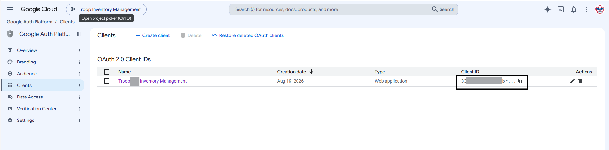
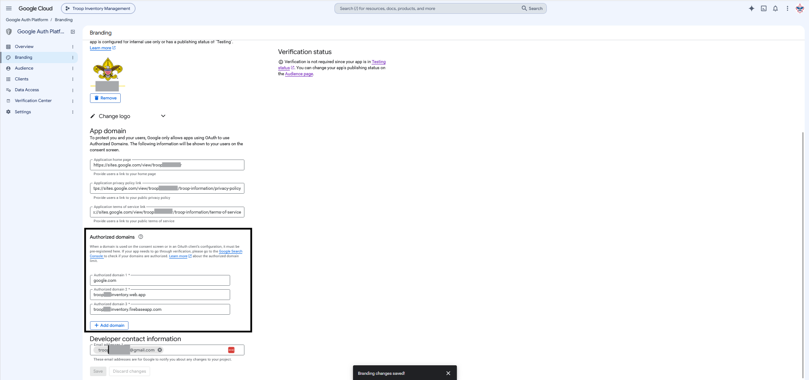
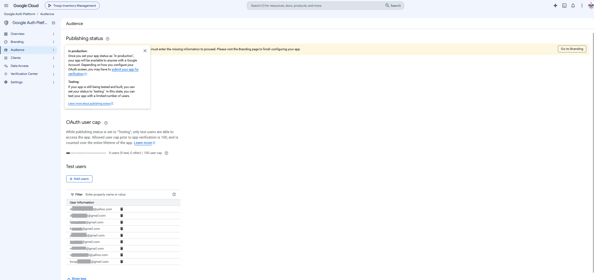

# Setup Google Cloud

Google Cloud is used to setup the client that will use Google Authentication for.  You must brand this 
so google sees this as a legitimate use of their services.

Launch the [Google Cloud Authentication](https://console.cloud.google.com/auth) as your organization's Google user.

## Setup a New Oath 2.0 Client ID

You need to create a client.  This is what you will be using Google's authentication to have the user log into
You define the client application here, and will come back and fill in the URLs once you host the application.
In this client create make sure you copy the Client ID.  You will need this for the customization *clientId* in
the orgConfig.json file.

## Configure the Branding For Your Google Client

In the Google Auth Branding Configuration, setup your organization name, location, image, etc...
I setup the home page for our troop on ours.  We use google sites.  I also created a private policy page
and terms of service that are both hidden from navigation but can be used here.  You will need to come
back after you setup hosting of the files to fill in the authorized URLs.

## Configure the Allowed Users

I am keeping my application in testing state, because we have so few users using it.  I will used
the allowed users to manage who can authenticate to it.

