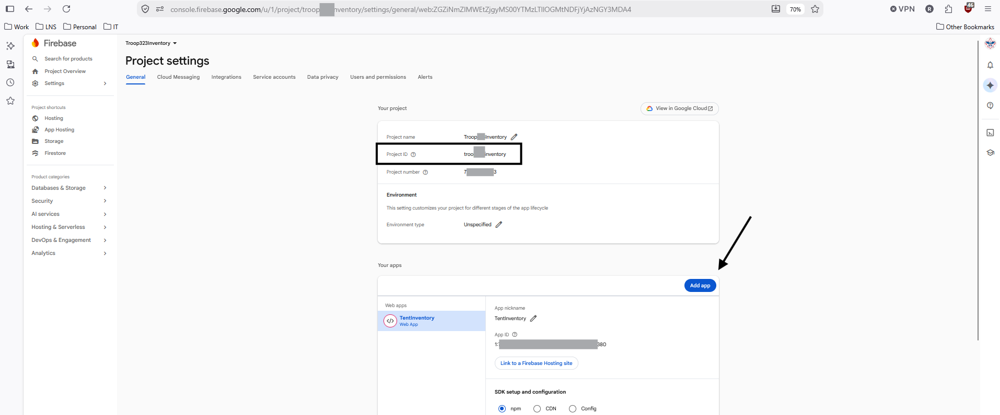
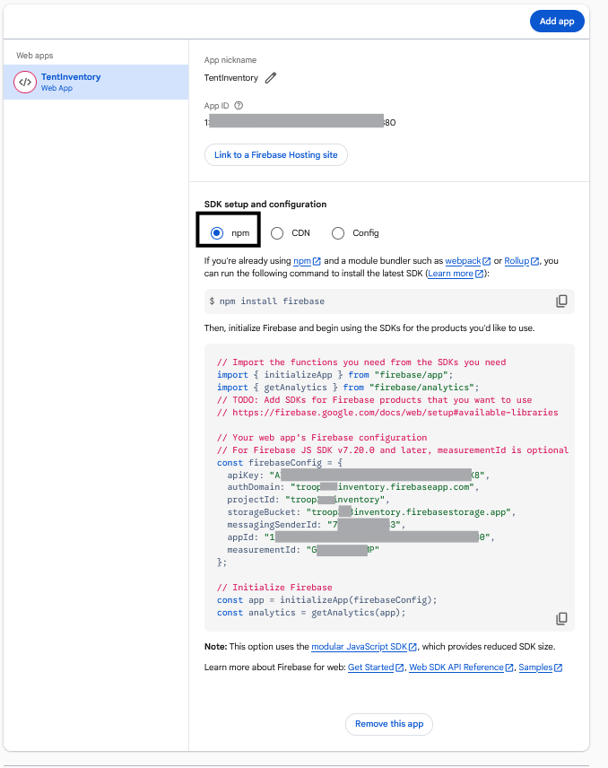
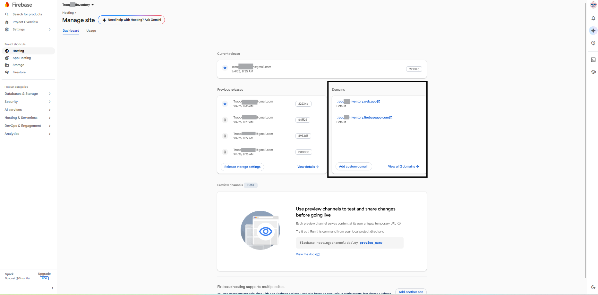

# Setup Google Firebase

I found us still needing a seperate site to host the few files needed to run this application.
We use Google Sites for our web page, but that does not allow you to host custom index.html,
javascript, etc... files.  Firebase if used with the spark plan allows you a no cost hosting.

Go to [Google Firebase](https://console.firebase.google.com/u/1/project)

## Setup a new project

Create a new project.  In the project you want to get the project ID.  Set the boxed area
below.  You will also want to setup a new App, see the arrow button.  



In your configured application, set it up to be populated via NPM.  Use the configuration
provided to configure your node package manager, npm, to push the application directly to
your firebase application.



In the Hosting section, go to the Domains.  You will need to go back to [Google Cloud Setup](googlecloudsetup.md)
to configure the URLs as allowed URLs.

 

Configure the local file in your build area:
```.firebaserc
{
  "projects": {
    "default": "<YOURPROJECTID>"
  }
}
```

## Install the Firebase tools

### `npm install -g firebase-tools`

## Intialize your Firebase Project

### `firebase init`

