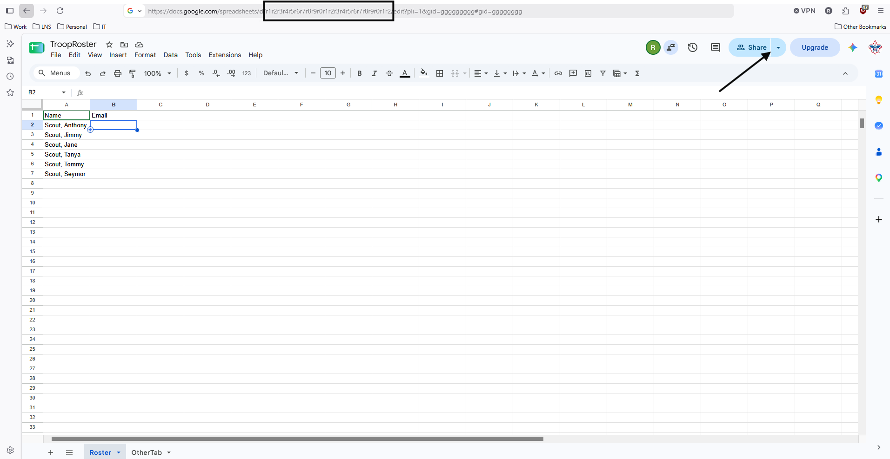

# Setup Google Sheets

Google sheets is used as both the backend services and the datastore for the inventory application.

Launch the [Google Sheets](https://docs.google.com/spreadsheets) as your organization's Google user.

## Setup A Roster Sheet

You need to create a Roster Google Sheet.  This sheet will have two columns, Name and Email.  You can get
the sheetId in the URL, see the black box around the location below.  Then ensure you share the sheet using
the share button on the sheet to the google IDs that will authenticate to the application.  Lastly get the
tab name of the roster.  You will need the sheet ID and roster tab name for the customizations.

## Setup An Inventory Sheet

You will also need to setup a google sheet *for every* inventory item type you setup.  Below is an example
of our tent sheet.  You will have the Columns: ID, Description, Status, Who, Date, and Notes.  If there
are extra columns they are not modified by the application.  ID and Description are provided and never
modified by the application.  Status needs to be populated with the initial value from: Available, In Use,
or Broken.  The other 3 columns are only ever written to by the application.  Like the Roster Google sheet,
you need to share the sheet with Editor privileges to any user that will authenticate to the application.

