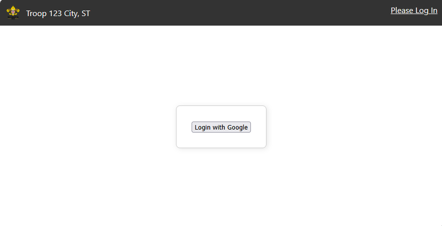
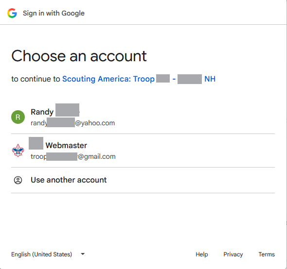
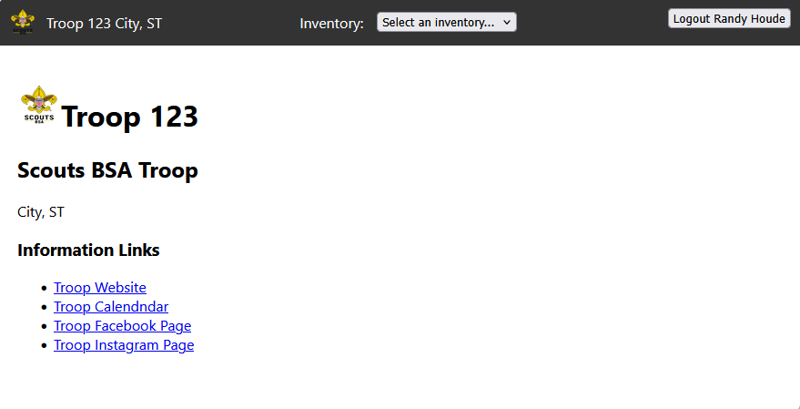
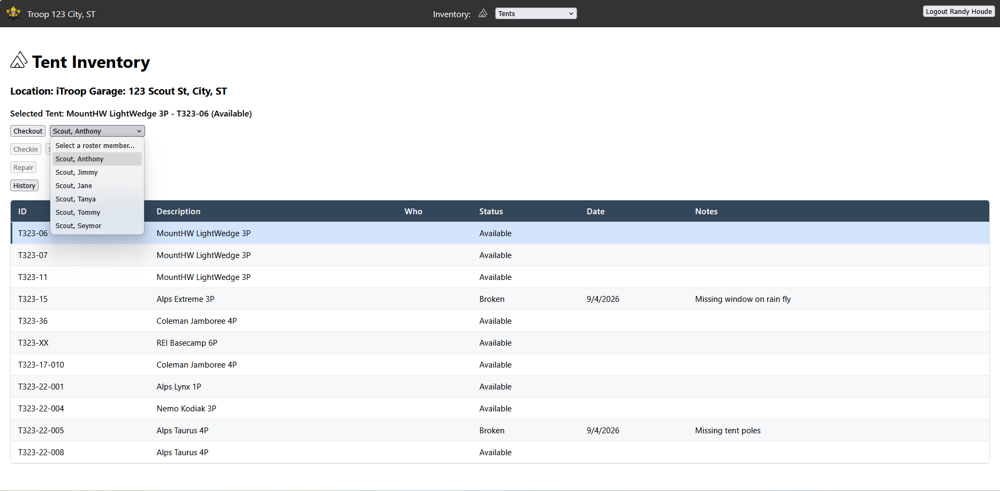
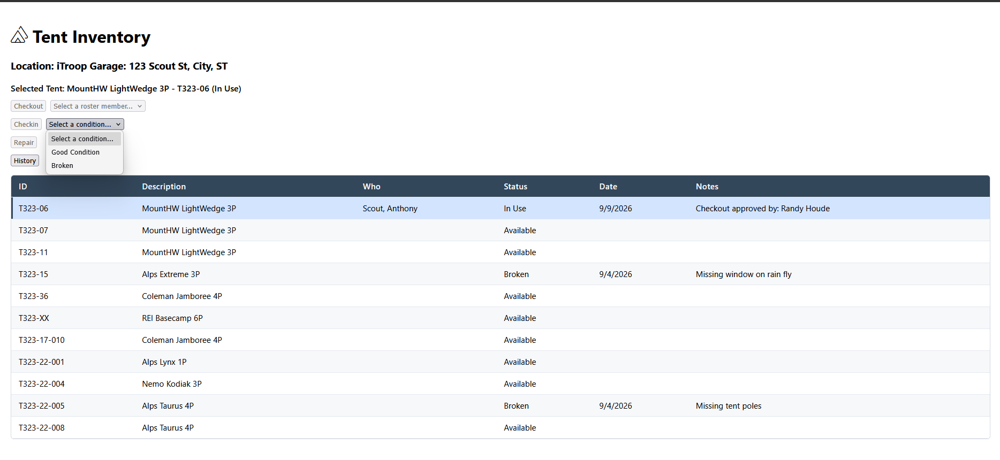
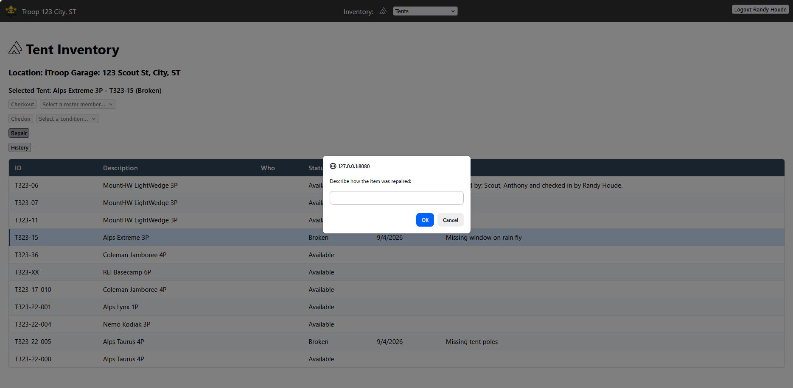
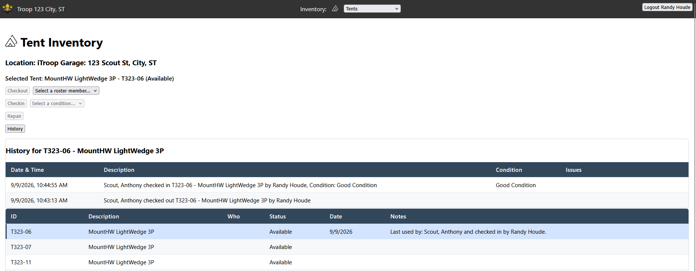

# Inventory Application - How To Use

## Logging In

Go to the URL:   https://<hosted location>/login

Then select the *Login with Google* button.  This will launch a Google Authentication popup window.

You will need to trust the provider of the application.  It will on initial login ask 
that you trust it to edit some spread sheets.  Those sheets should be owned by the 
organization's google account and shared to user with editor privs so its OK that
this appliation is editing those documents.

Now that you are logged in, you will see the landing page.  This will display any 
inforamtional links you wanted for your organization.

From the landing page you can select and inventory from the top.  For this example I
will select Tents, because that is one of the object types I have for my example.

## Checking Out An Item

If you select one of the rows that is Available, the user will see the Checkout button
becomes enabled.  You can then choose a user that will be borrowing this item and 
press the checkout button.  That will change the row to In Use by that person you
loaned the item out to.

## Checking In An Item

If you select one of the rows that is In Use, the user will see that the Checkin
button becomes enabled.  If you select a condition of Good Condition then when the
Checkin button is clicked the item will go back to Available and can be used by 
another person.  If a condition of Broken is selected when checking the item back in
the user will be prompted for a reason the item is broken.  Its status will be set to
Broken and the notes will describe how the item is broken.  This description will also
be added to the history for this item.  The item must then be repaired prior to 
another user being able to use the item.

 
## Repairing a Broken Item

If you select one of the rows that is Broken, the Repair button will enable.  The
user can then can provide a short decription of how the item was repaired.  This
will also be put into the history for the item.  

## Viewing the History of an Item

Lastly on any selected row, you can view the history for an item.  This will be 
displayed with most recent events at the top, allowing for quickly telling the basic
history of an item.  This is useful for telling if someone returned a damaged object
without reporting that it needed repair or returning the item as dirty, etc...

